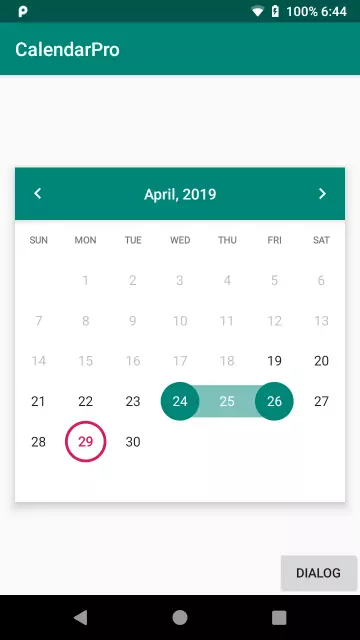

# calendar-pro
[](https://jitpack.io/#kakadu-dev/calendar-pro)
[](http://www.apache.org/licenses/LICENSE-2.0)



Android calendar view with custom decoration for each cell.

## Setup

Add the dependency in your `build.gradle` file:

```gradle
repositories {
    maven { url "https://jitpack.io" }
}

 dependencies {
   debugImplementation 'com.github.RomanTsarou:calendar-pro:1.0.1'
 }
```


